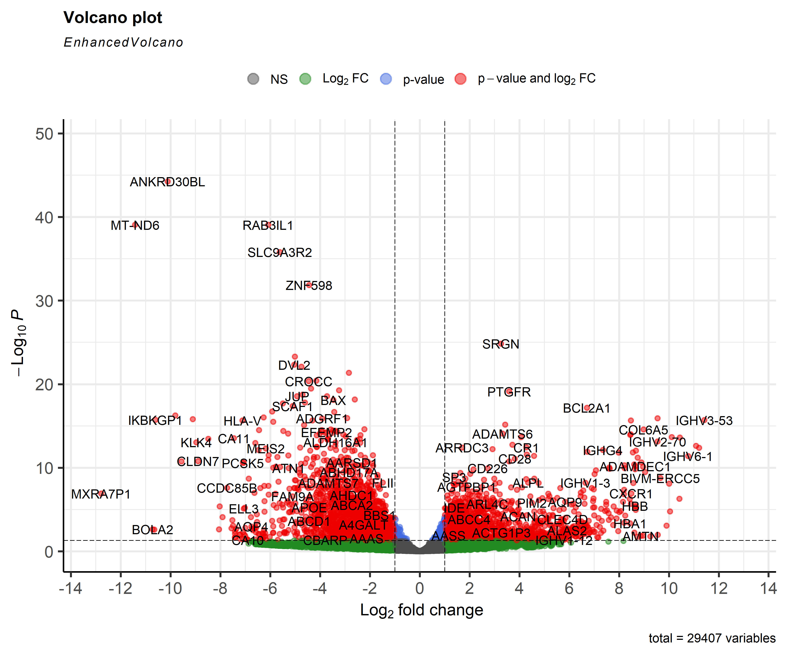
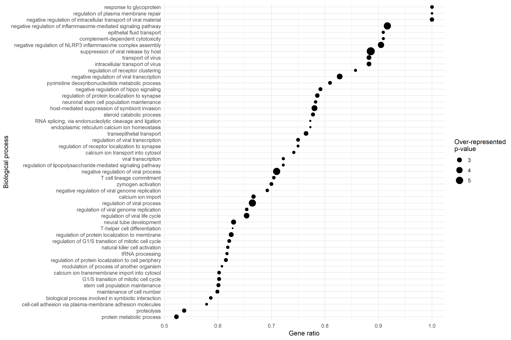

**Rheumatoïde artritis-patiënten tonen verhoogde expressie van enkele genen betrokken bij ontsteking, pannusformatie, gewrichtsbeschadiging, en autoimmuniteit.**

# Inhoudsopgave

1.  [Inhoud/structuur](#org538ecd8)
2.  [Inleiding](#orgc8116e1)
3.  [Methode](#org8aaa76c)
    1.  [Flowchart](#org6756b44)
    2.  [Sampling](#org774dee3)
    3.  [Indexeren, mapping, kwantificatie](#orgb786196)
    4.  [Fold change, volcano plot](#orgefc6afe)
    5.  [Verwerking (pathway, GO)](#org82814af)
4.  [Resultaten](#orgfe4a2ac)
    1.  [Statistische analyse en volcano plot](#orgc609e34)
    2.  [KEGG pathway-analyse](#org9182e8f)
    3.  [Gene ontology](#org7b5ece4)
5.  [Conclusie](#orgb7d612a)
6.  [AI-verklaring](#org29d6c53)
7.  [Referenties](#org310c8df)
8.  [Data stewardship](#ds)
9.  [Github-pagina](#gh)

# Inhoud/structuur

-   `/figures/` — bevat de gemaakte figuren (Volcano plot, KEGG-Pathway, GO-plot);
-   `/results/` — bevat tabellen met gegenereerde data, voor verder gebruik of ter referentie;
-   `README.md` — het Markdown-bestand dat dient als beschrijving van deze pagina;
-   `counting.R` — de code die gebruikt is om een count matrix te maken;
-   `processing.R` — de code die gebruikt is voor de dataverwerking.

# Inleiding

Rheumatoïde artritis (RA) is een chronische auto-immuunziekte die zorgt voor ontstekingen in het gewrichtsslijmvlies [(Choy, 2012)](#org34d8534), en progressieve afname in lichamelijke functie en levenskwaliteit veroorzaakt [(Smolen et al., 2016)](#org2f93bdd).

Het komt wereldwijd bij 0.5—1.0% van de mensen voor [(Silman & Pearson, 2002)](#org9cfa5de), met significante verschillen in voorkomen in verschillende populaties [(Alamanos et al., 2006)](#orgd7a78c3), en is hiermee één van de meest veelvoorkomende chronische ontstekingsziekten.

RA heeft een genetisch component [(Silman et al., 1993)](#org41ae648), en wordt beïnvloedt door omgevings- en levensstijlfactoren. In ACPA-positieve patiënten is met name roken bijvoorbeeld een significante factor  [(Malmström et al., 2017)](#orgb2cf74a).

Ontregelde RNA-expressie is mogelijk betrokken bij de progressie van de ziekte, door het verstoren van celfunctie rond immuniteit en ontsteking. Voorgaande onderzoeken rondom RNA hebben ontregelde pathways en ziekte-gebonden moleculaire kenmerken geïdentificeerd [(Ciechomska et al., 2026)](#org5c9c4ce). Het veld van transcriptomics biedt dus relevant opties voor analyse met betrekking tot RA.

In dit onderzoek wordt RNA-sequencing data van individuen met/zonder rheumatoïde artritis gebruikt, om per gen verschillen in transcriptie-aantal aan te tonen. Deze data wordt in een volcano plot weergegeven, wordt gebruikt voor pathway analyse met de RA KEGG-pathway, en voor gene ontology-analyse. 

# Methode

## Flowchart

    ╭────────────────╮               ╭────────────────╮
    │Referentiegenoom│               │  Geïndexeerd   │
    │  (GRCh38.p14)  ├──╴Indexeren╶─→│referentiegenoom│
    ╰────────────────╯               ╰───────┬────────╯
    ╭────────────────╮                       ▼
    │ RNA-sequencing │               ╭───────┴────────╮            Verwerkingsmethoden:
    │ files (.fastq) ├───╴Mapping╶──→│   .BAM-files   │            ───────────────────╴
    ╰────────────────╯               ╰───────┬────────╯            → Volcano plot (EnhancedVolcano)
    ╭────────────────╮                       ▼                     → KEGG pathway analyse (Pathview)
    │    Annotatie   │               ╭───────┴────────╮            → Gene ontology (goseq)
    │referentiegenoom├──╴Reads/gen╶─→│  Count matrix  │
    │   (.gtf-file)  │ kwantificeren ╰───────┬────────╯
    ╰────────────────╯                       ▼
                                        Statistische
                                       analyse (DESeq)

**Figuur 1: Flowchart van onderzoeksmethode.** *Flowchart die het proces voor het verkrijgen van bruikbare data weergeeft, en ook de verwerkingsmethoden die op deze data zijn uitgevoerd.*

## Sampling

RNA-sequencing is uitgevoerd op acht gewrichtsslijmvliessamples (vier van personen zonder RA, vier van personen met RA). De personen in de *met-RA* groep zijn positief getest op ACPA, de personen uit de controlegroep zijn negatief getest. Deze RNA-seq data is afkomstig uit eerder uitgevoerd onderzoek van [Platzer et al. (2019)](#orgc6f7071). Een overzicht van de gebruikte samples is te vinden in [sample\_table.csv](sample_table.csv).

## Indexeren, mapping, kwantificatie

Voor de verwerking van de RNA-sequencing data is eerst het menselijke refentiegenoom *[GRCh38.p14](https://www.ncbi.nlm.nih.gov/datasets/genome/GCF_000001405.40/)* (FASTA) geïnstalleerd, en vervolgens geïndexeerd met de `buildindex` functie van de *[Rsubread](#org5fa2a31)* (v2.24.0) package. Deze index is gebruikt voor het mappen van de paired-end RNA-seq bestanden van alle acht samples, met `align` (Rsubread). Met de resulterende Binary Alignment Map (BAM)-bestanden is een count matrix opgesteld, met behulp van het annotatie-bestand (Gene Transfer Format) behorend bij het [referentiegenoom](https://www.ncbi.nlm.nih.gov/datasets/genome/GCF_000001405.40/). De count matrix is opgesteld met `featureCounts` (Rsubread).

De [count matrix](results/count_matrix_RA.txt) bevat de genen (als rijnamen) met de transcriptie-counts, en de samples behorend bij die count-waarden (als kolomnamen). De code voor het opstellen van een count matrix is the vinden in het script [counting.R](counting.R).

## Fold change, volcano plot

De hierna beschreven stappen zijn allen terug te vinden in [processing.R](processing.R):

`DESeqDataSetFromMatrix` en `DESeq` (*[DESeq2](#org4842ea5)*, v1.50.2) zijn gebruikt om de Log2FoldChange en p-waarden te bepalen. De DESeq-resultaten zijn te vinden in [DESeq\_results.csv](results/DESeq_results.csv).

Een volcano plot ([figuur 2](#org59a4b2f)) is gemaakt met de *[EnhancedVolcano](#org15bb8e6)* (v1.28.2) package, met drempelwaarden van `p < 0.05` en `|Log2FoldChange| > 1`.

## Verwerking (pathway, GO)

De Log2FoldChange-waarden zijn gecombineerd met de KEGG pathway *[hsa05323](https://www.kegg.jp/pathway/hsa05323)* (Rheumatoid arthritis — Human) met `pathview` ([pathview](#org6db31d6), v1.50.0), met het bereik ingesteld op `Log2FoldChange: -5 tot 5`.

Voor de gene ontology zijn alleen de genen met `|Log2FoldChange| > 1` geselecteerd. De gennamen zijn van type `geneSymbols` naar `ensGene` omgezet, met behulp van de *[EnsDb.Hsapiens.v79](#orgb6954e7)* (v2.99.0) en *[ensembldb](#orge88bb19)* (v2.34.0) packages. Met `nullp` (*[goseq](#org13b7d08)*, v1.62.0) is een Probability Weighing Function opgesteld, die gebruikt is voor `goseq` (goseq) met refentiegenoom `hg19`, en id-type `ensGene`. Hiermee zijn de enriched GO-terms bepaald. De enriched GO-terms met overrepresentatie `p < 0.01` zijn geselecteerd voor nadere inzage. De lijst van deze terms is te vinden in [gene\_ontology\_result.txt](results/gene_ontology_result.txt).

*[ggplot2](#org4ca1cd5)* (v4.0.3) is gebruikt om met de enriched GO-terms een grafiek ([figuur 4](#org98d7020)) te maken, waarin de overrepresentatie van de meest significante biologische processen weergegeven wordt. 

# Resultaten

## Statistische analyse en volcano plot

Uit de `DESeq`-analyse kwamen 5103 genen met een statistisch significant verschil; hiervan hadden 4556 genen ook een `|Log2FoldChange| > 1`.

Alleen kijkend naar de resultaten met p < 0.05, was de hoogste fold change 11.4, bij het gen IGHV3-53. De laagste fold change was -12.8, bij het gen MXRA7P1. (Zie [DESeq\_results.csv](results/DESeq_results.csv) voor alle waarden.) In de onderstaande volcano plot ([figuur 2](#org59a4b2f)) zijn de resultaten visueel weergegeven:

 **Figuur 2: Volcano plot rheumatoïde artritis.** *Volcano plot gebaseerd op drempelwaarden van p < 0.05 en |Log2FoldChange| > 1. De grafiek loopt van Log2FoldChange -14 tot 14, gezien er geen waarden buiten deze grenzen vielen.*

## KEGG pathway-analyse

Veel van de coderende sequenties in de KEGG pathway voor rheumatoïde artritis ([hsa05323](https://www.kegg.jp/pathway/hsa05323)) zien verhoogde transcriptie bij RA-patiënten. Hieruit kan opgemaakt worden dat ontstekingen, pannusformatie (agressieve groei in de slijmvliesbekleding van de gewrichtsholten), en gewrichtsbeschadiging bij deze individuen verhoogd zijn ([figuur 3](#org55df3df)).

 **Figuur 3: Analyse met KEGG pathway *Rheumatoid arthritis***

*De berekende Log2FoldChange-waarden, gecombineerd met de KEGG pathway hsa05323 (Rheumatoid arthritis — Human), met het bereik ingesteld op Log2FoldChange: -5 tot 5. Rode vakken tonen positieve correlatie met de genen aan.*

## Gene ontology

Uit de data zijn 21429 enriched GO-terms verkregen, waarvan 83 er een *over-represented p-value* van < 0.01 hadden. Deze 83 GO-terms zijn te vinden in het [gene\_ontology\_result.txt](results/gene_ontology_result.txt) bestand. Van de 83 GO-terms, beschreven er 50 biologische processen. Deze zijn gebruikt om een grafiek op te stellen. In de grafiek is te zien dat de meest significante *over-represented p-values* betrekking hadden tot ontsteking en virale processen ([figuur 4](#org98d7020)).  

**Figuur 4: Biologische processen (GO-terms) en overrepresentatie.** *Op de x-as is het 'gene-ratio' te zien. Dit zijn de genen met differentiële expressie, gedeeld door het totaal aantal genen in de categorie. Op de y-as zijn deze 'categorieën' te zien; GO-terms die allen een ander biologisch proces beschrijven. De puntgrootte wordt bepaald door de -log10 van de 'over-represented p-value'; bij grotere waarden is de kans op toeval wat betreft de overrepresentatie kleiner.*

# Conclusie

Veel IGHV-genen zagen verhoogde transcriptie, wat wijst op hogere B-cel activiteit. CLEC4D, een gen uit het CTL-domein (betrokken bij ontsteking en immuunrespons), zag ook verhoogde transcriptie. Uit KEGG pathway-analyse is op te maken dat de *RA-groep* bij meerdere relevante genen verhoogde transcriptie hebben. Deze genen worden in verband gebracht met ontstekingen, pannusformatie, en gewrichtsbeschadiging. Met de gene ontology-analyse zijn processen geselecteerd die overgerepresenteerd zijn in de getestte individuen met RA. Kijkend naar de biologische processen binnen deze selectie, is de overrepresentatie het meest significant rond ontsteking en virale processen. De resultaten uit de DESeq, pathway, en GO-analyse komen overeen met de bekende symptomen van rheumatoïde arthritis.

# AI-verklaring

Voor het maken van deze GitHub-pagina is geen gebruik gemaakt van AI-hulpmiddelen.

# Referenties

 Alamanos, Y., Voulgari, P. V., & Drosos, A. A. (2006). Incidence and Prevalence of Rheumatoid Arthritis, Based on the 1987 American College of Rheumatology Criteria: A Systematic Review. *Seminars in Arthritis and Rheumatism*, 36(3), 182-188. <https://doi.org/10.1016/j.semarthrit.2006.08.006>

 Blighe K, Rana S, Lewis M (2026). EnhancedVolcano: Publication-ready volcano plots with enhanced colouring and labeling. R package version 1.31.0, <https://bioconductor.org/packages/EnhancedVolcano>

 Choy, E. (2012). Understanding the dynamics: Pathways involved in the pathogenesis of rheumatoid arthritis. *Rheumatology*, 51(suppl 5), v3-v11. <https://doi.org/10.1093/rheumatology/kes113>

 Ciechomska, M., Oldak, M., & Massalska, M. (2026). Transcriptomics and AI-driven approaches to the diagnosis and treatment of rheumatoid arthritis. *Frontiers in Immunology*, 17. <https://doi.org/10.3389/fimmu.2026.1812290>

 Liao, Y., Smyth, G. K., & Shi, W. (2019). The R package Rsubread is easier, faster, cheaper and better for alignment and quantification of RNA sequencing reads. *Nucleic Acids Research*, 47(8), e47. <https://doi.org/10.1093/nar/gkz114>

 Love, M. I., Huber, W., & Anders, S. (2014). Moderated estimation of fold change and dispersion for RNA-seq data with DESeq2. *Genome Biology*, 15(12), 550. <https://doi.org/10.1186/s13059-014-0550-8>

 Luo, W., & Brouwer, C. (2013). Pathview: An R/Bioconductor package for pathway-based data integration and visualization. *Bioinformatics*, 29(14), 1830-1831. <https://doi.org/10.1093/bioinformatics/btt285>

 Malmström, V., Catrina, A. I., & Klareskog, L. (2017). The immunopathogenesis of seropositive rheumatoid arthritis: From triggering to targeting. *Nature Reviews Immunology*, 17(1), 60-75. <https://doi.org/10.1038/nri.2016.124>

 Platzer, A., Nussbaumer, T., Karonitsch, T., Smolen, J. S., & Aletaha, D. (2019). Analysis of gene expression in rheumatoid arthritis and related conditions offers insights into sex-bias, gene biotypes and co-expression patterns. *PLOS ONE*, 14(7), e0219698. <https://doi.org/10.1371/journal.pone.0219698>

 Rainer, J., Gatto, L., & Weichenberger, C. X. (2019). ensembldb: An R package to create and use Ensembl-based annotation resources. *Bioinformatics*, 35(17), 3151-3153. <https://doi.org/10.1093/bioinformatics/btz031>

 Rainer, J. (2026). Ensembl based annotation package. <https://doi.org/10.18129/B9.bioc.EnsDb.Hsapiens.v79>

 Silman, A. J., Macgregor, A. J., Thomson, W., Holligan, S., Carthy, D., Farhan, A., & Ollier, W. E. R. (1993). TWIN CONCORDANCE RATES FOR RHEUMATOID ARTHRITIS: RESULTS FROM A NATIONWIDE STUDY. *Rheumatology*, 32(10), 903-907. <https://doi.org/10.1093/rheumatology/32.10.903>

 Silman, A. J., & Pearson, J. E. (2002). Epidemiology and genetics of rheumatoid arthritis. *Arthritis Research & Therapy*, 4(3), S265. <https://doi.org/10.1186/ar578>

 Smolen, J. S., Aletaha, D., & McInnes, I. B. (2016). Rheumatoid arthritis. *The Lancet*, 388(10055), 2023-2038. <https://doi.org/10.1016/S0140-6736(16)30173-8>

 Wickham, H. (2016). ggplot2: Elegant Graphics for Data Analysis. *Springer-Verlag New York, 2016.* <https://ggplot2.tidyverse.org>

 Young, M. D., Wakefield, M. J., Smyth, G. K., & Oshlack, A. (2010). Gene ontology analysis for RNA-seq: Accounting for selection bias. *Genome Biology*, 11(2), R14. <https://doi.org/10.1186/gb-2010-11-2-r14>

# Data stewardship

Data stewardship is een belangrijk deel in het onderzoeksproces, zeker als het aankomt op veiligheid, transparantie, en samenwerking. Data op een gecontroleerde manier ordenen maakt het mogelijk voor grotere groepen om te werken met de data, in plaats van maar één individu die slechte organisatie heeft maar weet waar de dingen zijn die hij/zij nodig heeft. Ook is het belangrijk dat privégegevens niet verder strekken dan de bedoeling is; hiervoor is het ook cruciaal om een systematische aanpak te hanteren.

Een ideale mappenstructuur zorgt ervoor dat gebruikers in één oogopslag een goed idee hebben van waar ze data en code kunnen vinden. Beschrijvende namen (van zowel folders als bestanden) zijn hier belangrijk voor. Bij gecompliceerde datasets kan het hierbovenop handig zijn om een clarificatie van de organisatie toe te voegen aan documentatie, die makkelijk te vinden is (bijvoorbeeld door toevoeging van een README-bestand aan de hoofdfolder.) Eén van de belangrijkste aspecten van goede naamgeving is consistentie; als er bijvoorbeeld dezelfde dataverwerking op meerdere bestanden wordt uitgevoerd, waarmee een bijbehorende nieuwe set bestanden gegenereerd wordt, is het een goed idee om dezelfde methode van naamgeving te gebruiken. Dan is het duidelijk welke bestanden (van voor + na verwerking) bij elkaar horen, en ook dat de bestanden (die een map en een naamstructuur delen) waarschijnlijk overeenkomen.

Versiebeheer ('Version control, VC') is het bijhouden van veranderingen aan bestanden naar verloop van tijd. De meestgebruikte VC-software is Git. Hier worden aanpassingen gebundeld in 'commits', waarbij de individuele veranderingen (bijvoorbeeld elk stuk tekst dat toegevoegd/verwijderd is) per commit te zien zijn. Dit is waardevol voor het vinden van de auteur, datum, en versie behorend bij een stuk code van interesse, en voor het bekijken van de verschillen tussen releases. Verder geeft versiebeheer een mogelijkheid op het gebied van samenwerking: verschillende auteurs kunnen op verschillende momenten aan hetzelfde project werken, en toevoegingen kunnen voor samenvoeging met de hoofdbranch gecontroleerd worden.

Goede documentatie van scripts gebeurt op verschillende plekken: Als eerste in het bestand zelf. Door een logische volgorde en structuur van code, en door het toevoegen van comments die onderdelen ordenen of verklaren, zijn scripts een stuk beter te lezen en te begrijpen voor nieuwe bijdragers. Hierna zijn een beschrijvende bestandsnaam en een passende folder belangrijk. Verder kan externe beschrijving van / referentie naar het script mensen wijzen op wat het bestand inhoudt, en waar ze het kunnen vinden.

Het meestgebruikte online platform voor het delen van code is GitHub, maar alternatieven met vergelijkbare functionaliteit worden steeds populairder (onder andere gezien GitHub bij Microsoft hoort). Veel open-source projecten gebruiken zulke platforms, wat het toegankelijk maakt, en contributie (zoals issues en pull requests) van gebruikers mogelijk maakt. Openbare datasets zijn belangrijk voor transparantie omtrent de reproduceerbaarheid van onderzoek. Zo kan men controleren of de gegeven resultaten daadwerkelijk te verkrijgen zijn uit de toegeleverde data en werkwijze, en kunnen fraudulente publicaties geïdentificeerd worden.

# GitHub-pagina

Versiecontrole is voor dit onderzoek gedaan met behulp van Git; als interface is [Magit](https://magit.vc/) gebruikt. De typische structuur van een wetenschappelijk onderzoek (van inleiding tot conclusie) is gebruikt voor de communicatie van de methode en resultaten van het onderzoek. Alle gebruikte data (van referentiegenoom tot fastq-bestanden) is toegankelijk, met enkele tussenstappen zoals de count matrix en de onverwerkte gene-ontology resultaten ook geleverd, voor gebruiksvriendelijkheid. Alle gebruikte code is ook geleverd, en hiermee is dit onderzoek volledig reproduceerbaar. De R-code is georganiseerd als twee losse scripts, zodat men makkelijk gelijk aan de slag kan gaan met de inbegrepen voltooide count matrix, zodra de methode van generatie hiervoor is gecontroleerd.

Veel methoden zijn gebruikt om het project overzichtelijk te maken; het meeste hiervan is terug te vinden in de README. Als eerste is een beschrijvende titel toegevoegd om meer duidelijkheid te geven over de daadwerkelijke inhoud van het project (de beschrijving van de GitHub-pagina zelf is algemener). Hoewel GitHub uit zichzelf een optionele inhoudsopgave genereert uit Markdown-bestanden, helpt de toevoeging van een inhoudsopgave aan het bestand zelf om de structuur van de README aan te geven. Dit zorgt er ook voor dat er toegang blijft tot een inhoudsopgave, zelfs als de repository op een ander platform dan GitHub wordt beheerd. Ook is aan het begin een kopje 'Inhoud/structuur' toegevoegd, waarin de inhoud van de folders en de belangrijkste bestanden kort beschreven wordt, zodat de lezer gelijk een idee heeft waar alles te vinden is.

Ook een *flowchart* is opgesteld, om de werkwijze in één oogopslag te verhelderen. De verwerkingsmethoden zijn hierin ook in een lijst verwerkt, zodat men gelijk weet waar de data daadwerkelijk voor gebruikt is. Omdat Markdown codeblokken toestaat, was het mogelijk om de flowchart te maken uit plaintext, met behulp van [Uniline](https://github.com/tbanel/uniline). Verder is gebruik gemaakt van Markdown-functionaliteit om te verwijzen naar hoofdstukken, bestanden, locaties, en URLs binnen het bestand zelf. De hoofdstukverwijzing is gebruikt voor het maken van een interactieve inhoudsopgave, de bestandsverwijzing is gebruikt om naar relevante bestanden te linken in de werkwijze, en de locatieverwijzing is gebruikt voor het maken van in-tekst citaten die naar de bijbehorende artikelen in de referenties leiden.

Ook is er naar webpagina's verwezen voor externe materialen, zoals bijvoorbeeld het [referentiegenoom](https://www.ncbi.nlm.nih.gov/datasets/genome/GCF_000001405.40/). Hoewel het in principe mogelijk geweest zou zijn om de grote bestanden (zoals de gecreëerde alignments) in de repository te hebben, zou het de gebruiksvriendelijkheid verminderen, gezien de volledige dataset >20GB bedraagt. Het is van belang dat de repository weinig opslagruimte inneemt; ten eerste omdat gebruikers de inhoud naar hun eigen apparaat moeten 'pull'en willen ze er aan kunen werken, ten tweede omdat GitHub zelf ook [limieten](https://docs.github.com/en/repositories/creating-and-managing-repositories/repository-limits) heeft van hoeveel ruimte één repository in mag nemen. Het volledige project neemt meer dan >20GB in, dus er moest gekozen worden welke data essentiëel is voor de reproduceerbaarheid, en welke data door toekomstige gebruikers zelf weer gecreëerd kan worden. Bovenop het complete minimum is wel een selectie van extra verwerkingsbestanden toegevoegd, om het makkelijker te maken om aan de slag te gaan met de gegeven code.
